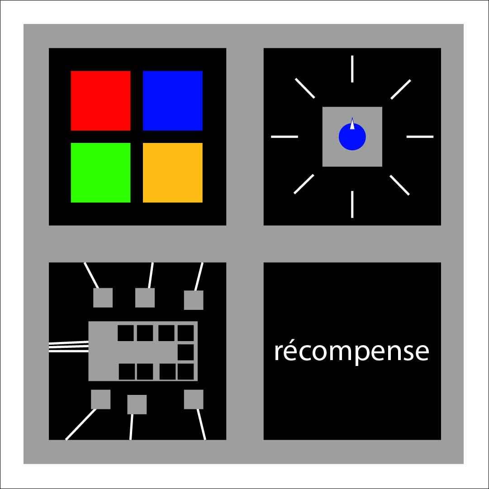

# Chrono Logique

Un jeu d'évasion présenté sous forme d'une machine à remonter le temps.

## Synopsis

Vous vous retrouvez dans le passé. L'ancien propriétaire d'une machine à voyager dans le temps a laissé une suite d'énigmes de sécurité afin de vous empêcher de partir. Votre but est de déverrouillé la machine qui vous ramènera à votre ère.

### Étape 1

Une suite de couleurs apparaissent à l'écran. Il faut cliquer sur les Key-Unit aux couleurs respectives afin de débloquer l'énigme prochaine.

### Étape 2

Il faut ajuster l'Encoder pour arriver aux chiffres désirés pour former un code. Les chiffres se trouvent dans le décor autour, et le but de ce code est de débloquer la boîte de contrôle. La boîte se débloquera à l'aide d'un bras mécanique.

### Étape 3

Lorsque la boîte est débloquée, un système de fils est présenté. Il faut essayer de lier les deux fils ensembles afin de débloquer la récompense et traverser le temps vers l'ère d'aujourd'hui.

## Logiciels

- Arduino
- Unity ?
- TouchDesigner ?

## Plan

## Progression

### Semaine 11

Code des Key Units

### Semaine 12

Code du Encoder + moteur

### Semaine 13

Code des fils

### Semaine 14

Finaliser TouchDesigner + Reaper

### Semaine 15

Présentation

## Recherches pour le code

ServoMoteur: https://arduino-france.site/servo-arduino/

ServoMoteur: https://www.otronic.nl/fr/schemas-de-raccordement-et-code-dexemple/schema-de-connexion-de-servomoteur-et-code-dexempl/
